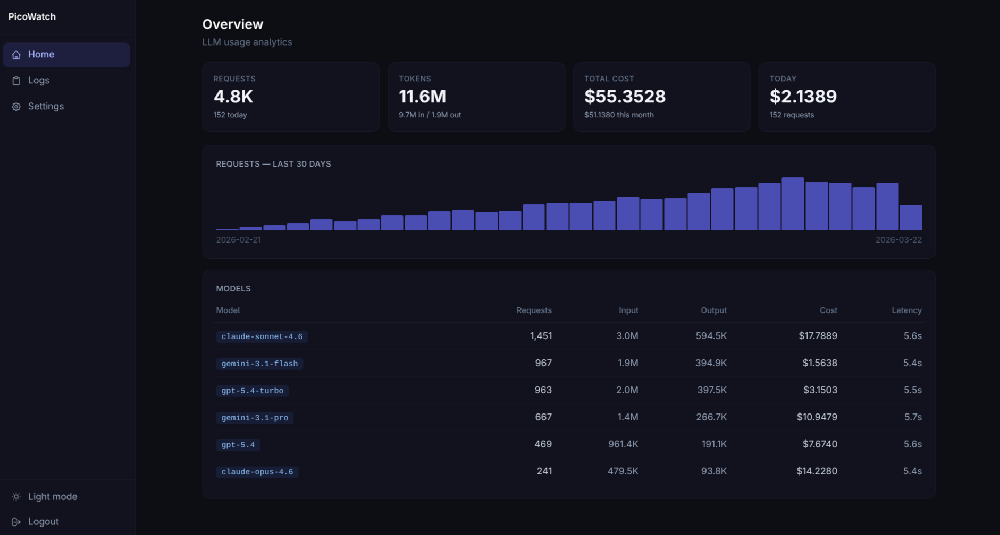

# PicoWatch

PicoWatch is an ultra-lightweight, self-hosted observability and logging dashboard designed specifically for tracking LLM (Large Language Model) API usage, costs, and performance. 

Built with **Go** and **SvelteKit**, it compiles down to a **single, dependency-free binary** that consumes merely ~24 MB of RAM while serving a fully-featured modern web interface.



---

## Features

- **Single Binary Deployment**: The entire Svelte frontend is statically compiled and embedded directly into the Go backend executable (`//go:embed`). No Node.js, Docker, or external web servers required.
- **Incredibly Lightweight**: 
  - **Memory:** Runs on ~24 MB of RAM (RSS).
  - **Storage:** The compiled standalone binary is only ~16 MB.
- **LLM Cost & Pricing Tracking**: Syncs directly with OpenRouter to pull the latest AI model pricing, automatically calculating your token costs across different models.
- **Secure by Default**: Built-in authentication system with secure API key management and `/setup` wizard for the initial admin account.
- **SQLite Database**: Zero configuration database using SQLite (with WAL mode enabled for performance). Just run the file and your data is persisted locally in `picowatch.db`.
- **Data Retention**: Configurable auto-cleanup for old logs to ensure the database stays small and snappy over time.

---

## Tech Stack

- **Backend:** Go (Golang) + standard `net/http` router
- **Database:** SQLite3
- **Frontend:** SvelteKit (Static Adapter) + TailwindCSS
- **Communication:** RESTful JSON API

---

## Building from Source

To build PicoWatch from source, you need **Go (1.21+)** and **Node.js**:

1. **Build the Svelte Frontend**
   ```bash
   cd ui
   npm install
   npm run build
   cd ..
   ```
   *This compiles the Svelte frontend into static HTML/JS/CSS inside the `ui/build` directory.*

2. **Compile the Go Binary**
   ```bash
   go build -o picowatch .
   ```
   *The Go compiler will embed the `ui/build` directory directly into the compiled executable.*

---

## Running the Application

Simply execute the compiled binary. By default, the server will start on port `8080`.

```bash
./picowatch
```

Optionally, you can override the port using an environment variable:
```bash
PORT=3000 ./picowatch
```

### First Launch (Setup)
On the very first launch, open `http://localhost:8080` in your browser. You will be redirected to the secure `/setup` page to create your master admin account and generate your first API key.

---

## API Usage Example

Once you have your API Key, you can log your LLM requests easily from anywhere:

```bash
curl -X POST http://localhost:8080/api/logs \
  -H "Authorization: Bearer YOUR_API_KEY" \
  -H "Content-Type: application/json" \
  -d '{
    "model": "gpt-4-turbo",
    "prompt_tokens": 120,
    "completion_tokens": 45,
    "latency_ms": 1250
  }'
```

## License

MIT License
